<!--
  ███ SMS-12 // PROFILE.SYS ███
  • ./assets             → visuels animés faits main (SVG)
  • branche « output »   → statistiques et serpent, régénérés toutes les 6 h
                           par .github/workflows/profile.yml
-->

  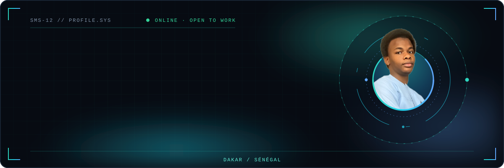

 

<!-- ─────────────────────────── 01 · IDENTITY ─────────────────────────── -->
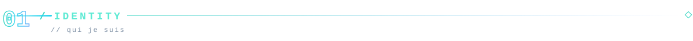

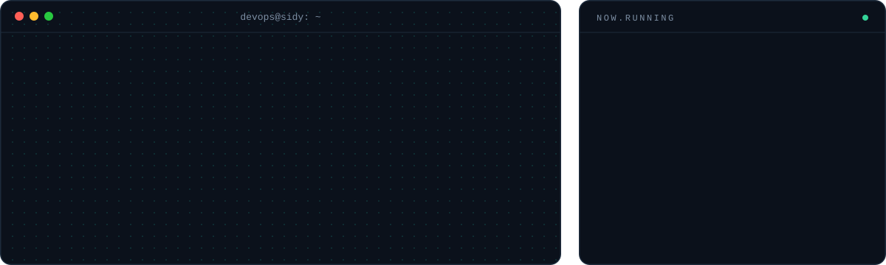

  

<!-- ─────────────────────────── 02 · SYSTEMS ─────────────────────────── -->
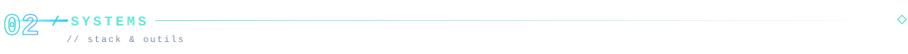

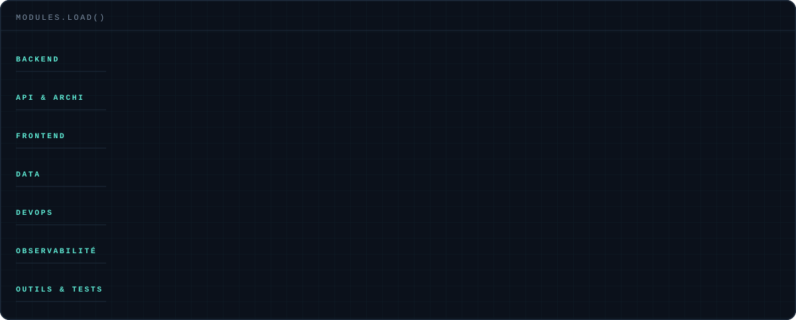

  

<!-- ─────────────────────────── 03 · MISSIONS ─────────────────────────── -->
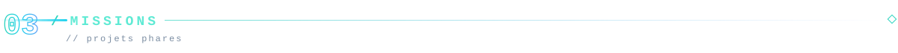

<!-- ✏️ Remplace le lien si CETUD Mobilités a une page publique -->
<a href="https://github.com/sidymohamed12?tab=repositories">
  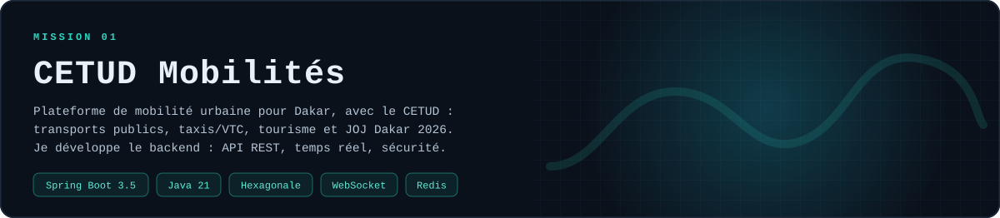
</a>

  <a href="https://github.com/sidymohamed12/jwt-toolkit-package">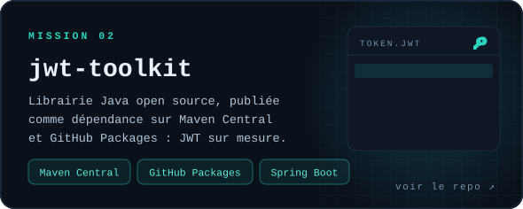</a>
  <a href="https://sms-12-portfolio.onrender.com">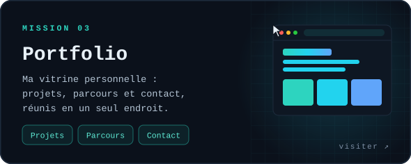</a>

 

<!-- ─────────────────────────── 04 · TELEMETRY ─────────────────────────── -->
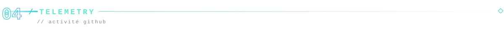

  <picture>
    <source media="(prefers-color-scheme: dark)" srcset="https://raw.githubusercontent.com/sidymohamed12/sidymohamed12/output/snake-dark.svg"/>
    <source media="(prefers-color-scheme: light)" srcset="https://raw.githubusercontent.com/sidymohamed12/sidymohamed12/output/snake-light.svg"/>
    
  </picture>

 

<!-- ─────────────────────────── 05 · UPLINK ─────────────────────────── -->
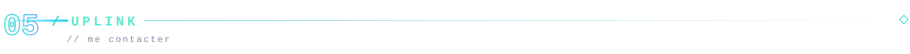

  <a href="https://sms-12-portfolio.onrender.com">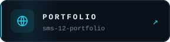</a>
  
  <a href="mailto:mohamedsaizonou86@gmail.com">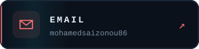</a>
  <a href="https://wa.me/221761823698">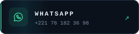</a>

  
  

 

  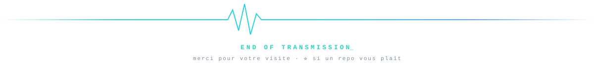

