# <div align="center"></div>

<div align="center">
  


<p>
  
  
  
</p>


</div>

---

## &nbsp;***À propos de moi***


```typescript
const SidyMohamed = {
    pronouns: "He" | "Him",
    location: "Dakar, Sénégal 🇸🇳",
    code: ["Java", "TypeScript", "C#", "HTML/CSS"],
    askMeAbout: ["Spring Boot", "Angular", "RESTful APIs", "Microservices"],
    technologies: {
        backend: {
            java: ["Spring Boot", "Spring Security", "JPA/Hibernate"],
            csharp: ["ASP.NET", ".NET Core"],
            databases: ["PostgreSQL", "MySQL", "MongoDB"]
        },
        frontend: {
            js: ["Angular", "TypeScript"],
            css: ["Tailwind CSS", "Bootstrap", "SCSS"]
        },
        devOps: ["Docker", "Git", "CI/CD"],
        tools: ["IntelliJ IDEA", "VS Code", "Postman", "DBeaver"]
    },
    architecture: ["Microservices", "RESTful APIs", "MVC", "Clean Architecture"],
    currentFocus: "Building scalable applications with Spring Boot & Angular",
    funFact: "I turn coffee into clean, efficient code! ☕️→💻"
};
```

> ### 💫 *"Le code n'est pas juste une suite d'instructions, c'est l'art de transformer des idées en solutions qui impactent positivement la vie des gens."*

---

##  ***Compétences Techniques***

<div align="center">

### 🚀 **Backend Development**
<p>
  
  
  
  
  
</p>

### 🎨 **Frontend Development**
<p>
  
  
  
  
  
</p>

### 🗄️ **Bases de Données**
<p>
  
  
  
</p>

### 🛠️ **Outils & Technologies**
<p>
  
  
  
  
</p>

</div>

---

##  ***Statistiques GitHub***

<div align="center">
  <a href="https://github.com/sidymohamed12">
    
  </a>
</div>

<div align="center">
  <a href="https://github.com/sidymohamed12">
    
  </a>
</div>

<div align="center">
  <a href="https://github.com/sidymohamed12">
    
  </a>
</div>

### 📊 **Graphique de Contribution**


---

## 🏆 ***Mes Spécialités***

```mermaid
graph TD
    A[🚀 Développement Full-Stack] --> B[Backend Spring Boot]
    A --> C[Frontend Angular]
    A --> D[APIs RESTful]
    
    B --> E[🔒 Spring Security]
    B --> F[🗄️ JPA/Hibernate]
    B --> G[🏗️ Microservices]
    
    C --> H[🎨 TypeScript]
    C --> I[💅 Tailwind CSS]
    C --> J[📱 Responsive Design]
    
    D --> K[🔐 JWT Authentication]
    D --> L[📋 Documentation OpenAPI]
    D --> M[⚡ Performance Optimization]
    
    style A fill:#3B82F6,stroke:#1E3A8A,color:#ffffff
    style B fill:#6366F1,stroke:#312E81,color:#ffffff
    style C fill:#8B5CF6,stroke:#5B21B6,color:#ffffff
    style D fill:#06B6D4,stroke:#0E7490,color:#ffffff
```

<div align="center">



</div>

---

## 🌟 ***Projets Phares***

<div align="center">

### 🏢 **SenDev Vision Platform**
> Plateforme de développement digital innovante avec architecture microservices


**Features:**
- 🔌 **APIs RESTful sécurisées** avec JWT Authentication
- 🏗️ **Architecture microservices** scalable
- 🎨 **Interface moderne** avec Angular & Tailwind CSS
- ☁️ **Déploiement cloud** optimisé
- 📊 **Dashboard analytique** en temps réel

### 🎯 **Autres Projets**
<table>
<tr>
<td width="50%">

**🔥 API Management System**
- Spring Boot + PostgreSQL
- Sécurité avancée avec Spring Security
- Documentation OpenAPI/Swagger
- Tests unitaires & intégration

</td>
<td width="50%">

**💼 E-Commerce Platform**
- Full-Stack Angular + Spring Boot
- Paiement intégré & gestion stock
- Interface admin complète
- Performance optimisée

</td>
</tr>
</table>

</div>

---

## 📈 ***Metrics de Performance***

<div align="center">

| Métrique | Valeur | Progression |
|----------|--------|-------------|
| 🏗️ **Projets Complétés** | `15+` |  |
| 🔌 **APIs RESTful Créées** | `25+` |  |
| 🨠**Interfaces Développées** | `20+` |  |
| ☕ **Tasses de Café** | `∞` |  |

</div>

---

## 🎯 ***Ma Stack Technique Préférée***

<div align="center">

```yaml
Architecture: "Microservices"
Backend:
  Framework: "Spring Boot 3.x"
  Security: "Spring Security + JWT"
  Database: "PostgreSQL + JPA/Hibernate"
  API: "RESTful + OpenAPI Documentation"
  
Frontend:
  Framework: "Angular 16+"
  Language: "TypeScript"
  Styling: "Tailwind CSS"
  State Management: "RxJS + Services"
  
DevOps:
  Containerization: "Docker"
  Version Control: "Git + GitHub"
  API Testing: "Postman + JUnit"
  
Best Practices:
  - Clean Architecture
  - SOLID Principles
  - Test-Driven Development
  - Code Review & Documentation
```

</div>

---

## 🌐 ***Contact & Réseaux***

<div align="center">


### 📫 **Restons Connectés !**

<p>
  <a href="https://sms-12-portfolio.onrender.com" target="_blank">
    
  </a>
  <a href="https://www.linkedin.com/in/sidy-mohamed-saizonou-4655b4262" target="_blank">
    
  </a>
  <a href="mailto:mohamedsaizonou86@gmail.com">
    
  </a>
  <a href="tel:+221761823698">
    
  </a>
</p>

### 🚀 **SenDev Vision**
> *Transforming ideas into digital reality*


</div>

---

## 🎨 ***Fun Zone***

<div align="center">

 <em><b>I love connecting with different people</b> so if you want to say <b>hi, I'll be happy to meet you more!</b> 😊</em>

### 🎵 **Code Jam** 🎵
```
🎵 While(coding) {
    ☕ drink(coffee);
    💻 write(cleanCode);
    🚀 build(amazingFeatures);
    😊 enjoy(process);
}
```

### 🌟 **Citation du Jour**


</div>

---

<div align="center">

### 💖 **Merci pour votre visite !**


**⭐ N'hésitez pas à explorer mes repositories et à me contacter pour des collaborations passionnantes !**

</div>

---

<div align="center">
  
</div>
